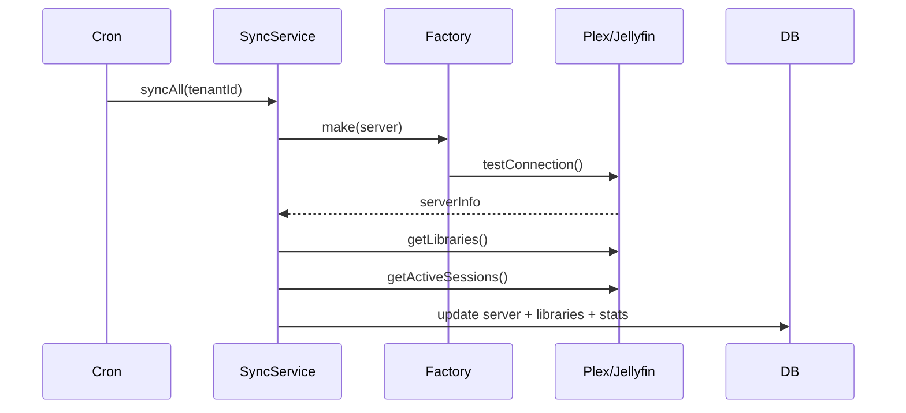

# Arquitectura MultiPanel ERP

## Visión general

MultiPanel ERP sigue **Clean Architecture** con capas bien definidas:

```
┌─────────────────────────────────────────────────┐
│                  Presentation                    │
│  Controllers · Views · API · Middleware          │
├─────────────────────────────────────────────────┤
│                  Application                     │
│  Services · DTO · Events · Jobs · Validators     │
├─────────────────────────────────────────────────┤
│                    Domain                        │
│  Models · Repositories · Business Rules          │
├─────────────────────────────────────────────────┤
│                 Infrastructure                   │
│  Database · Cache · Logger · HTTP Clients        │
└─────────────────────────────────────────────────┘
```

## Patrones de diseño

| Patrón | Uso |
|--------|-----|
| MVC | Separación presentación/lógica/datos |
| Repository | Abstracción de acceso a BD |
| Service Layer | Lógica de negocio desacoplada |
| Factory | Creación de integraciones Plex/Jellyfin |
| Middleware Pipeline | Auth, CSRF, Rate Limit, JWT |
| Active Record | Modelos con persistencia simple |
| Singleton | Application, Database, Session, Cache |

## Modelo de datos (ER)

```
tenants ──┬── users ──── user_sessions
          │              roles ─── role_permissions ─── permissions
          ├── servers ─── libraries
          │              server_stats
          ├── media_users ──┬── media_user_libraries
          │                 ├── media_user_tags ─── tags
          │                 └── media_user_groups ─── groups
          ├── customers ─── subscriptions ─── subscription_plans
          │              invoices
          ├── automation_rules
          ├── jobs (queue)
          ├── notification_channels ─── notifications
          ├── tickets ─── ticket_messages
          ├── playback_sessions
          ├── audit_logs
          ├── api_keys
          ├── settings
          └── backups
```

## Flujo de sincronización



## Seguridad

- **Passwords**: Argon2id con rehash automático
- **API**: JWT HS256 con refresh tokens
- **Web**: CSRF tokens + sesiones seguras (HttpOnly, SameSite)
- **Headers**: X-Content-Type-Options, X-Frame-Options, CSP ready
- **Rate Limiting**: Por IP + URI con cache file
- **Auditoría**: Registro completo de acciones administrativas
- **RBAC**: Roles con permisos granulares por tenant

## Escalabilidad

- Multi-tenant nativo (tabla `tenants`)
- Cola de trabajos asíncrona (`jobs`)
- Cache file-based (Redis ready via config)
- Paginación en todos los listados
- Índices optimizados en BD
- Cron distribuible por tarea

## Extensibilidad (Plugins)

Sistema de plugins preparado en tabla `plugins` para ampliar funcionalidad sin modificar el núcleo:

```
plugins/
├── tautulli/
├── overseerr/
├── stripe-billing/
└── telegram-bot/
```

Cada plugin registra hooks, rutas y servicios via autoload.
